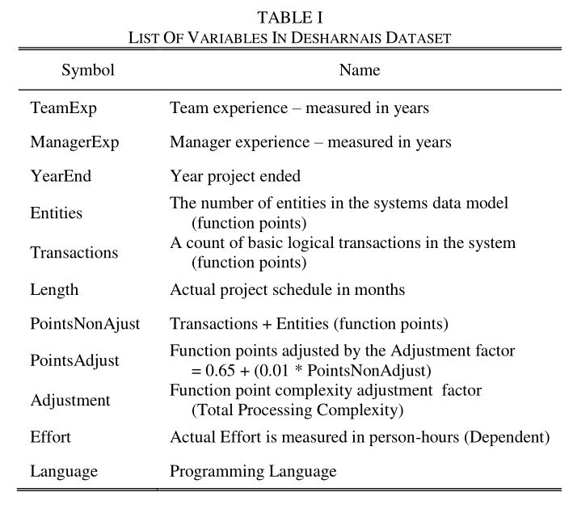
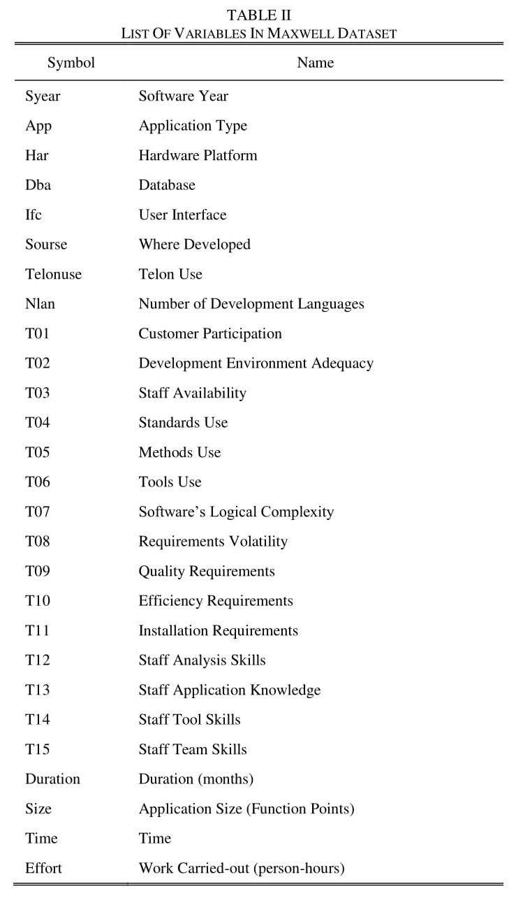

## Software Effort Estimation Using Machine Learning Techniques
VIII Semester Major Project

Dayananda Sagar University, Bangalore

### Desharnais dataset variables summary

### Maxwell dataset variables summary

### Insights

### Resources
- http://promise.site.uottawa.ca/SERepository/datasets/desharnais.arff
- https://zenodo.org/record/268461/files/maxwell.arff?download=1
- https://scikit-learn.org/stable/index.htm
- https://towardsdatascience.com/productionize-a-machine-learning-model-with-flask-and-heroku-8201260503d2
- https://github.com/krishnaik06/Complete-Feature-Selection/blob/master/2-Feature%20Selection-%20Correlation.ipynb

